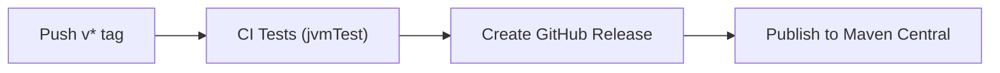

# Release Process

This guide documents the exact steps for publishing a new Kodio release, from version bumps through Maven Central publication.

## Overview

Releases are **tag-driven**. Pushing a `v*` tag to `master` triggers a GitHub Actions pipeline that:

1. Runs the full JVM test suite
2. Creates a GitHub Release with auto-generated changelog
3. Publishes all library artifacts to Maven Central



## Published Artifacts

| Module | Maven Coordinates | Description |
|--------|-------------------|-------------|
| Core | `space.kodio:core` | Audio recording, playback, formats |
| Compose | `space.kodio.extensions:compose` | Compose UI components |
| Compose Material3 | `space.kodio.extensions:compose-material3` | Material 3 themed components |
| Transcription | `space.kodio.extensions:transcription` | OpenAI Whisper transcription |

All modules are published as Kotlin Multiplatform artifacts with Android release variants.

## Prerequisites

### Required GitHub Secrets

The following secrets must be configured in the repository settings:

| Secret | Purpose |
|--------|---------|
| `MAVEN_CENTRAL_USERNAME` | Sonatype Central Portal username |
| `MAVEN_CENTRAL_PASSWORD` | Sonatype Central Portal password/token |
| `SIGNING_KEY_ID` | GPG key ID for artifact signing |
| `SIGNING_PASSWORD` | GPG key passphrase |
| `GPG_KEY_CONTENTS` | Base64-encoded GPG private key |

### Local Tools

- Git with push access to `master`
- GitHub CLI (`gh`) for monitoring workflows and verifying releases

## Release Checklist

### 1. Verify master is green

Check that CI is passing on `master`:

```bash
gh run list --branch master --limit 3
```

### 2. Update version numbers

There are three files that hold version references:

**`gradle.properties`** — the Gradle build version (used for local dev; CI overrides from the tag):

```properties
kodio.version=X.Y.Z
```

**`kodio-docs/v.list`** — the Writerside docs variable (all `%kodio-version%` placeholders in Installation, Getting Started, etc. resolve from this):

```xml
<var name="kodio-version" value="X.Y.Z"/>
```

**`README.md`** — the installation section has hardcoded version strings for all four artifacts. Update each `implementation(...)` line to the new version.

Update all three to the new release version.

### 3. Commit and push version bump

```bash
git add gradle.properties kodio-docs/v.list README.md
git commit -m "chore: bump version to X.Y.Z"
git push origin master
```

### 4. Review Release Drafter draft (optional)

The repository uses [Release Drafter](https://github.com/release-drafter/release-drafter) to accumulate a draft release from merged PRs. You can preview it in GitHub under **Releases > Draft**.

> **Note:** The publish workflow creates its own release with GitHub's auto-generated release notes (`generate_release_notes: true`), so the Release Drafter draft is a preview tool, not the final changelog.

### 5. Create and push the version tag

```bash
git tag vX.Y.Z
git push origin vX.Y.Z
```

**Tag format:**
- Stable releases: `v1.0.0`, `v0.2.0`
- Pre-releases: `v1.0.0-alpha`, `v1.0.0-beta.1`, `v1.0.0-rc.1`

Tags containing a hyphen (e.g., `v1.0.0-beta`) are automatically marked as **prerelease** on GitHub.

### 6. Monitor the pipeline

The tag push triggers `.github/workflows/publish.yml` which runs three sequential jobs:

```bash
# List recent workflow runs
gh run list --limit 5

# Watch the publish run in real-time
gh run watch <run-id>

# If a job fails, view its logs
gh run view <run-id> --log-failed
```

**Pipeline jobs:**

| Job | Runner | What it does |
|-----|--------|-------------|
| `test` | ubuntu-latest | Runs `./gradlew jvmTest` (reuses CI workflow) |
| `create-release` | ubuntu-latest | Creates GitHub Release via `softprops/action-gh-release@v2` |
| `publish` | macOS-latest | Runs `./gradlew publishToMavenCentral` (macOS needed for Apple targets) |

### 7. Verify the GitHub Release

```bash
gh release view vX.Y.Z
```

Confirm:
- Release name matches `vX.Y.Z`
- Release notes list the changes since the previous tag
- Prerelease flag is correct (should be `false` for stable releases)

### 8. Verify Maven Central artifacts

Artifacts appear on Maven Central after Sonatype processing (can take 15-30 minutes):

- [search.maven.org — space.kodio:core](https://search.maven.org/search?q=g:space.kodio)
- [central.sonatype.com](https://central.sonatype.com/artifact/space.kodio/core)

### 9. Post-release (optional)

Bump `gradle.properties` to the next SNAPSHOT version for local development:

```properties
kodio.version=X.Y.Z+1-SNAPSHOT
```

## How Changelog Generation Works

Two separate mechanisms exist:

### Release Drafter (draft preview)

Configured in `.github/release-drafter.yml`. Runs on every push to `master` and PR activity. Maintains a **draft** GitHub Release that categorizes merged PRs by label:

| Label | Category |
|-------|----------|
| `feature`, `enhancement` | Features |
| `fix`, `bugfix`, `bug` | Bug Fixes |
| `breaking`, `breaking-change` | Breaking Changes |
| `chore`, `maintenance`, `dependencies` | Maintenance |
| `documentation`, `docs` | Documentation |

PRs are **auto-labeled** based on branch name prefixes:
- `feature/*` → `feature`
- `fix/*`, `bugfix/*` → `fix`
- `chore/*` → `chore`
- `docs/*` → `documentation`

### GitHub Auto-Generated Notes (actual release)

The publish workflow uses `generate_release_notes: true` in `softprops/action-gh-release@v2`. This produces release notes based on commits and PRs between the previous tag and the new one, using GitHub's built-in format.

## Cleaning Up a Failed Release

If something goes wrong after a tag is pushed:

```bash
# Delete the GitHub Release
gh release delete vX.Y.Z --yes

# Delete the remote tag
git push origin :refs/tags/vX.Y.Z

# Delete the local tag
git tag -d vX.Y.Z
```

Fix the issue, then re-tag and push.

## Manual Publishing

For publishing without the CI pipeline (e.g., testing or emergency releases):

```bash
export ORG_GRADLE_PROJECT_mavenCentralUsername=<username>
export ORG_GRADLE_PROJECT_mavenCentralPassword=<password>
export ORG_GRADLE_PROJECT_signingInMemoryKeyId=<gpg-key-id>
export ORG_GRADLE_PROJECT_signingInMemoryKeyPassword=<gpg-password>
export ORG_GRADLE_PROJECT_signingInMemoryKey=<base64-gpg-key>

./gradlew publishToMavenCentral --no-configuration-cache -Pkodio.version=X.Y.Z
```

## Publishing to Maven Local (testing)

For testing artifacts locally before a release:

```bash
./gradlew publishToMavenLocal
```

Then add `mavenLocal()` to the consuming project's repositories block.

## Workflow Files Reference

| File | Purpose |
|------|---------|
| `.github/workflows/publish.yml` | Tag-triggered release pipeline |
| `.github/workflows/gradle.yml` | CI tests (reusable) |
| `.github/workflows/release-drafter.yml` | Drafts release notes from PRs |
| `.github/release-drafter.yml` | Release Drafter categories and template |
| `build-logic/src/main/kotlin/kodio-publish-convention.gradle.kts` | Maven publishing convention plugin |
| `gradle.properties` | Build version (`kodio.version`) |
| `kodio-docs/v.list` | Documentation version variable |
| `README.md` | Hardcoded installation snippet versions |
